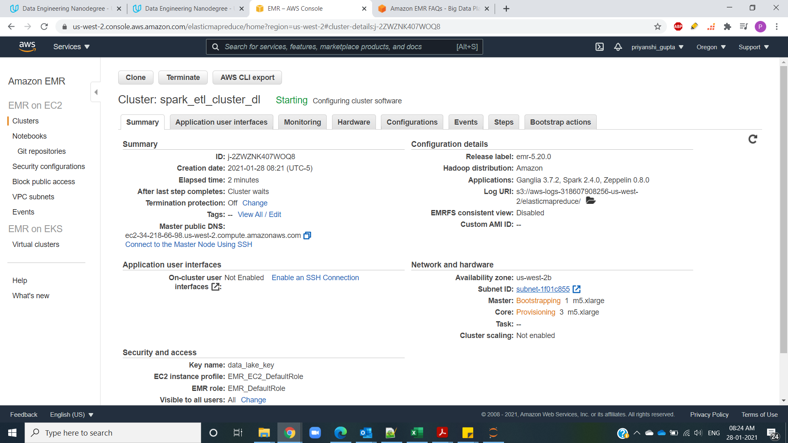
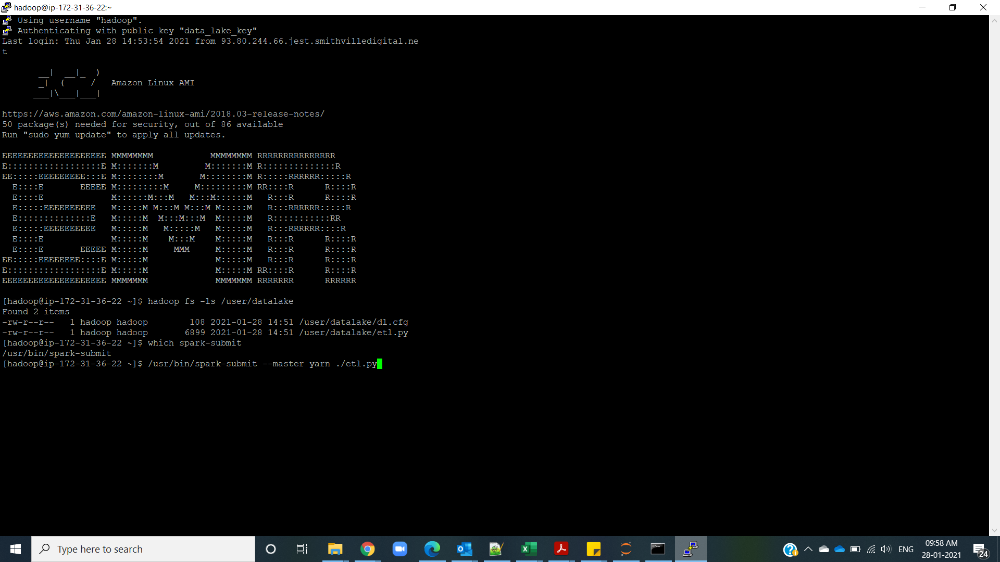
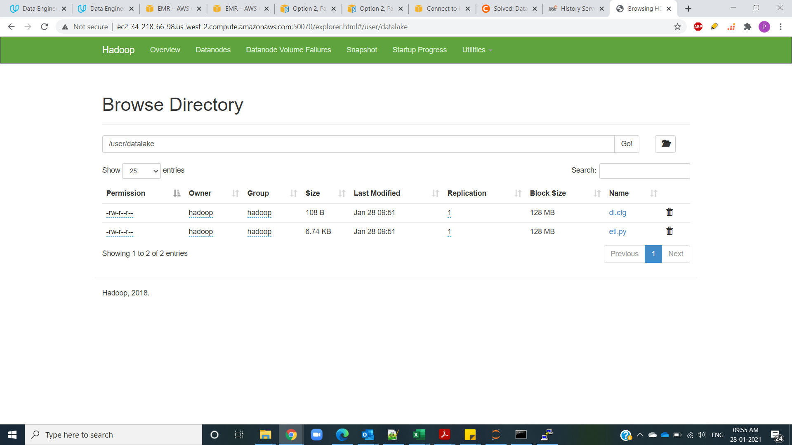
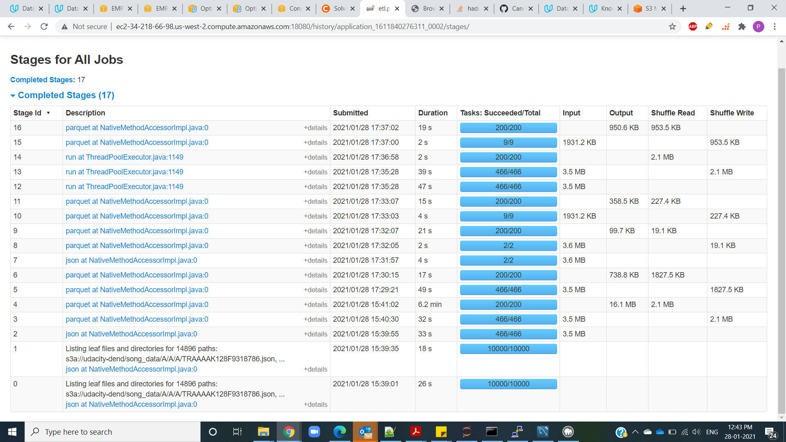
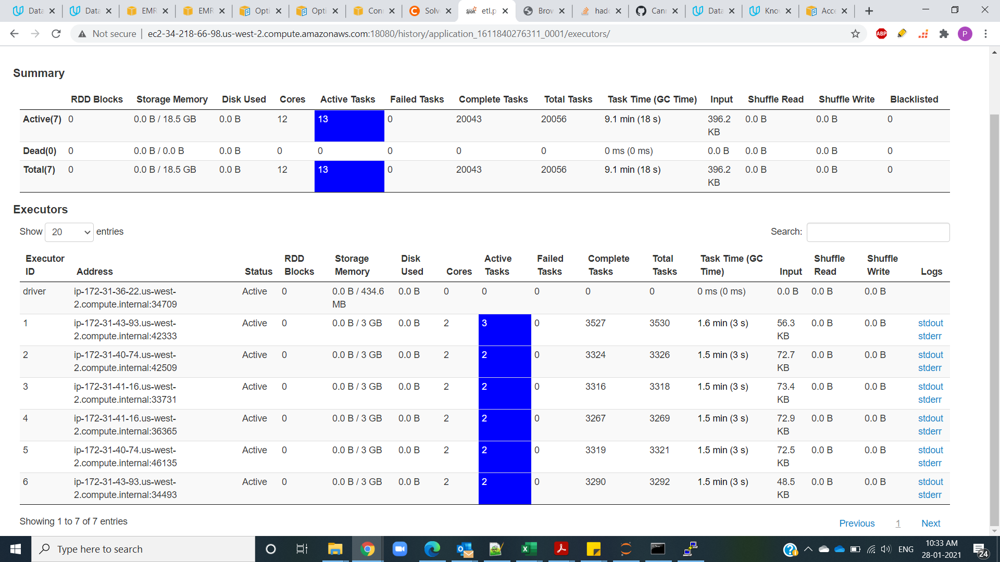
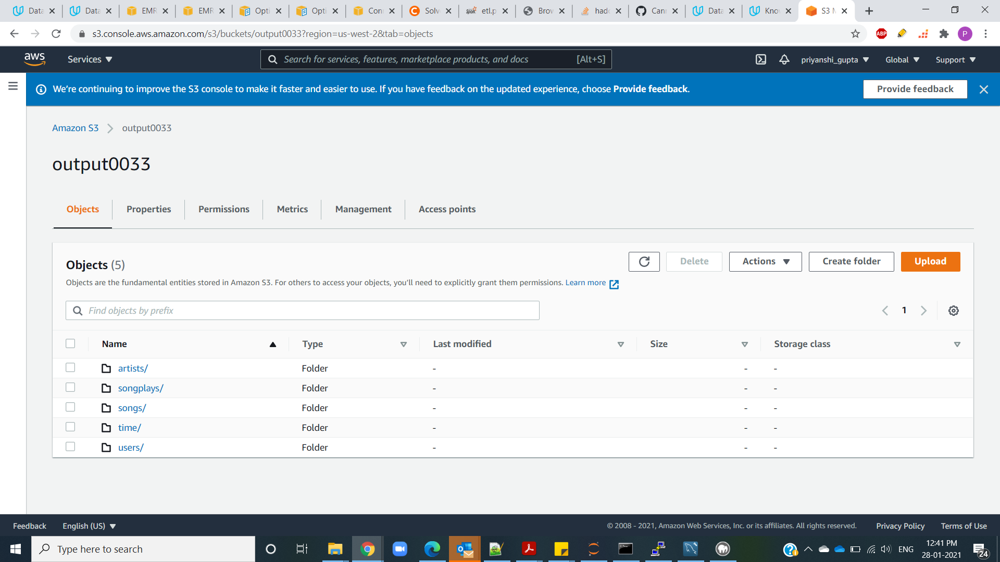

# Data Lake using AWS EMR and AWS S3

This project aims to develop a data lake for a company with growing data by making use of AWS ElasticMapReduce(EMR) service with Hadoop and Spark. 

The source information dwells in S3, in a directory of JSON logs. An ETL pipeline was created to extract the information from S3, measure them utilizing Spark, and load the information back into S3 as a bunch of dimensional tables. 
AWS EMR provided EC2 instances with configured tools like Hadoop, spark etc which was leveraged to execute spark jobs on Hadoop cluster.

## DataSet

The two datasets used for this project are as follows:

### Song Dataset
The first dataset is a subset of real data from the Million Song Dataset. Each file is in JSON format and contains metadata about a song and the artist of that song. The files are partitioned by the first three letters of each song's track ID. 

The files pertaining to this dataset are present in location:"s3://udacity-dend/song_data"

Example :
{"num_songs": 1, "artist_id": "ARJIE2Y1187B994AB7", "artist_latitude": null, "artist_longitude": null, "artist_location": "", "artist_name": "Line Renaud", "song_id": "SOUPIRU12A6D4FA1E1", "title": "Der Kleine Dompfaff", "duration": 152.92036, "year": 0}

### Log Dataset
The second dataset consists of log files in JSON format generated by this event simulator based on the songs in the dataset above. These simulate app activity logs from an imaginary music streaming app based on configuration settings.
The log files in the dataset are partitioned by year and month.

The files pertaining to this dataset are present in location:"s3://udacity-dend/log_data"

Example:

## Dimensional Modelling

Fact Table:
1. songplays -records in event data associated with song plays i.e. records with page NextSong
- songplay_id, start_time, user_id, level, song_id, artist_id, session_id, location, user_agent

Dimension Tables:
1. users - users in the app
- user_id, first_name, last_name, gender, level

2. songs - songs in music database
- song_id, title, artist_id, year, duration

3. artists - artists in music database
- artist_id, name, location, lattitude, longitude

4. time - timestamps of records in songplays broken down into specific units
- start_time, hour, day, week, month, year, weekday

I will be using AWS services to build an ETL pipeline for a data lake hosted on S3 location "s3://output0033"

## Process to Execute 

### 1.Create IAM Role on AWS

By accessing AWS Identity and Access Management (IAM) console, create a user with additional policies of AmazonS3FullAccess, AmazonEC2FullAccess and AdministratorAccess.Save the key and secret id.

### 2.Add the credentials to the Config file

Add the secret key and id into the config file "dl.cfg".

### 3.Create Key pair on EC2 machine.

I needed to create one SSH key pair to securely connect to the EMR cluster that I create.

### 4.Create EMR Cluster

Created an EMR cluster by using Infrasture as code methodology "InfraCode.py".
We can also craete it by access the AWS EMR console. 
Note: I created a cluster with 1 master node and 3 core, while creating the cluster I made sure to add spark application.

You can also login into AWS EMR console and verify the cluster is in the RUNNING or WAITING mode:

### 5.Import the executable files to HDFS

Connect to the EMR cluster with SSH and import the files to be executed on HDFS.

Below is the screen shot for your reference:

You can also check the HDFS browser by accessing the HDFS Namenode url.
Below is the screen shot for your reference:

Further you can submit the spark script in YARN mode by command:

/user/bin/spark-submit --master yarn ./etl.py

### 6.Monitor job

The job and stages will appear in the Spark History Server UI:

We can also monitor the Spark executors:

### Output

Each of the five tables were written to parquet files in a separate analytics directory on S3. Each table has its own folder within the directory. 

